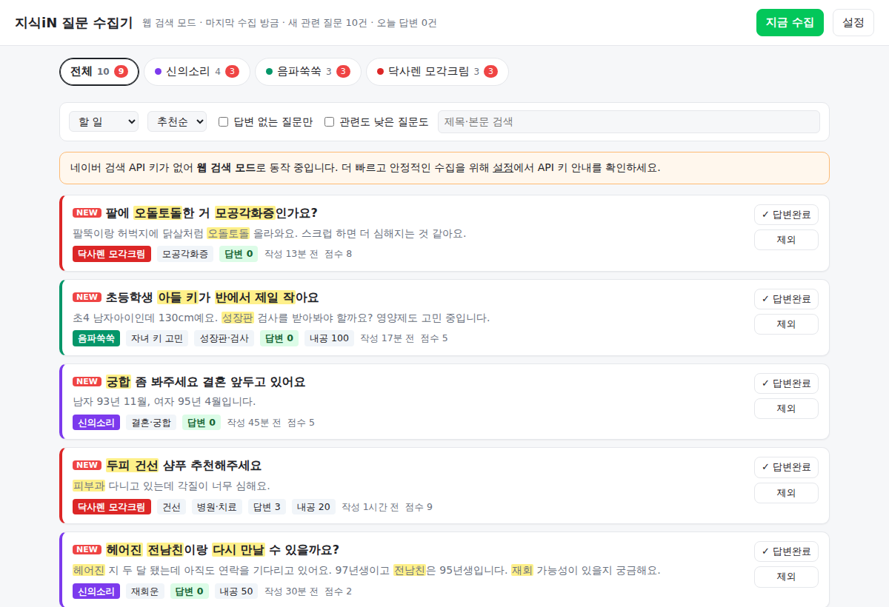
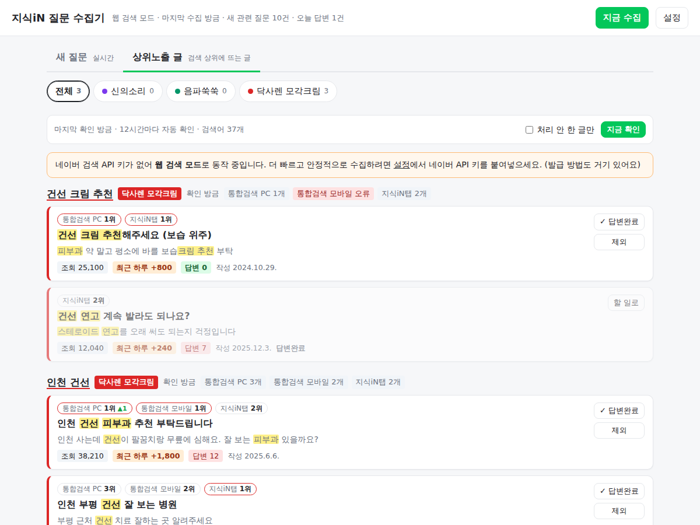

# 지식iN 질문 수집기

네이버 지식iN에 올라오는 질문 중 **내 제품·서비스와 관련된 질문만 자동으로 모아서**,
답변할 만한 순서대로 보여주는 프로그램입니다. 제목을 클릭하면 바로 그 질문 페이지가 열려 답변을 달 수 있습니다.

- **제품별 키워드**: 신의소리(신점·타로·사주), 음파쑥쑥(키 성장), 닥사렌 모각크림(모공각화증·건선)
- **카테고리 자동 분류**: 제품 키워드가 없어도 "헤어진 전남친이랑 다시 만날 수 있을까요?" 같은 질문을 `재회운` 으로 분류해서 모아줍니다.
- **추천순 정렬**: 관련도 + 답변 수가 적을수록 + 최근 질문일수록 위로. `답변 0` 질문은 초록색으로 표시됩니다.
- **할 일 관리**: 클릭한 질문은 흐리게 표시되고, `답변완료` / `제외` 를 누르면 목록에서 빠집니다. 같은 질문을 두 번 보지 않습니다.
- **자동 수집**: 켜두면 10분마다(설정 가능) 새 질문을 가져옵니다.
- **AI 답변 초안 (선택)**: Claude API 키가 있으면 제품별 답변 가이드에 맞춘 초안을 만들어 줍니다. 확인·수정 후 직접 붙여넣는 방식입니다.



---

## 1. 시작하기 (Windows 기준, 약 10분)

1. **내려받기**: GitHub 저장소 페이지 → 브랜치가 `claude/naver-knowledge-collector-ug8qeu` 인지 확인 →
   초록색 **Code** → **Download ZIP** → 압축 풀기
2. **실행**: 폴더의 **`start.bat` 더블클릭**
   - Python 이 없으면 자동으로 설치합니다. (설치 허용 창이 뜨면 '예')
   - "Windows의 PC 보호" 창이 뜨면 **추가 정보 → 실행**
   - 처음엔 1~3분 걸리고, 끝나면 브라우저에 대시보드(`http://127.0.0.1:5000`)가 열립니다.
3. **네이버 API 키 넣기**: 대시보드 **[설정] → API 키** 칸에 붙여넣고 [키 저장]. 발급 방법도 그 화면에 있습니다. (아래 2번)
4. **[연결 점검]** 버튼을 눌러 결과를 확인합니다. ⚠️ 가 나오면 [결과 복사]해서 Claude 에게 보내주세요.

> 검은 창을 닫거나 PC가 꺼지면 수집이 멈춥니다. 쓰는 동안 창을 켜두세요.

Mac / Linux 는 터미널에서 `./start.sh` (Python 3.10 이상 필요). 직접 실행하려면:

```bash
python -m venv .venv
.venv\Scripts\activate        # Mac/Linux: source .venv/bin/activate
pip install -r requirements.txt
python -m jisikin             # 대시보드 + 자동 수집
```

## 2. 네이버 검색 API 키 발급 (강력 권장, 무료)

키가 없어도 동작하지만(지식iN 검색 화면을 직접 읽는 **웹 모드**), 네이버 화면이 바뀌면 깨질 수 있고 느립니다.
공식 API 는 하루 25,000회까지 무료이고 안정적입니다.

1. <https://developers.naver.com/apps/#/register> 에서 애플리케이션 등록 (네이버 로그인, 처음이면 휴대폰 인증)
2. 애플리케이션 이름: 아무거나 (예: 지식인수집기)
3. **사용 API** 에서 `검색` 선택
4. **비로그인 오픈 API 서비스 환경** → `WEB 설정` → `http://127.0.0.1` 입력 → 등록하기
5. 내 애플리케이션 화면의 `Client ID`, `Client Secret` 을 대시보드 **[설정] → API 키** 에 붙여넣기

키는 이 PC의 `.env` 파일에만 저장되고, 저장하면 재시작 없이 바로 적용됩니다.

## 3. 키워드 · 카테고리 설정

대시보드 오른쪽 위 **[설정]** 에서 바로 고칠 수 있습니다 (파일로는 `config.yaml`).
저장하면 형식을 검사하고, 이미 모아둔 질문도 새 설정으로 **다시 분류**합니다.

```yaml
products:
  - id: sinui
    name: 신의소리
    keywords: [신점, 타로, 사주, 운세, 궁합]        # 들어가면 관련 질문 + 이 단어로 지식iN 검색
    exclude: [사주세요, 사줘, 사주고 싶]            # 이 표현은 가리고 판단 ("옷 사주세요" 무시)
    categories:
      - name: 재회운
        keywords: [재회, 헤어진, 전 남친, 연락 올까]  # 분류용 단어
        search: [재회운, 재회 가능성]                # 이 카테고리 질문을 찾기 위한 추가 검색어
    watch_urls: []                                  # 지식iN 분야 목록 주소 (선택)
    min_score: 2
    answer_guide: |                                 # AI 초안용 제품 설명
      신의소리는 신점·타로·사주 상담 사이트입니다...
```

**점수 규칙** (제품별로 계산, `min_score` 이상이면 수집)

| 어디에 있나 | 제품 키워드 | 카테고리 단어 |
|---|---|---|
| 제목 | 3점 | 2점 |
| 본문 | 2점 | 1점 |

→ 제품 키워드는 어디에 있든 수집, 카테고리 단어만 있는 질문은 **제목에 있을 때** 수집됩니다.

**띄어쓰기 규칙**: 키워드에 넣은 띄어쓰기는 있어도/없어도 찾습니다.
`키 크는 법` → "키크는법", "키 크는법", "키 크는 법" 모두 찾음. `건선` → "건선" 만 찾음 ("조건 선택" 같은 오탐 방지).

**제외어**
- `사주세요` : 그 표현만 가리고 판단합니다. "사주 봐주세요 (옷은 엄마가 사주세요)" 는 여전히 수집.
- `!주식` : 앞에 `!` 를 붙이면 그 단어가 있는 질문은 이 제품에서 아예 뺍니다.
- 정규식이 필요하면 `re:` 를 붙이세요. 예) `re:사주(?!세요|줘)`

**watch_urls (분야 감시)**: 지식iN에서 원하는 분야(예: 운세·사주, 피부과, 소아청소년과)의 질문 목록 페이지로 가서
주소창 URL 을 복사해 넣으면, 키워드 검색에 안 걸리는 새 질문도 그 분야에서 가져와 분류합니다.

**튜닝 팁**
- 대시보드에서 **[관련도 낮은 질문도]** 를 켜면, 점수가 모자라 빠진 질문이 흐리게 보입니다. 놓친 질문이 보이면 키워드를 추가하세요.
- 엉뚱한 질문이 들어오면 `exclude` 에 그 표현을 넣으세요.
- [설정] 화면의 **분류 테스트** 나 `python -m jisikin classify "질문 제목" "본문"` 으로 바로 확인할 수 있습니다.

## 4. 사용 흐름

1. 제품 탭(신의소리 / 음파쑥쑥 / 닥사렌) → 카테고리 칩(재회운, 성장판·검사 …)으로 좁히기
2. 제목 클릭 → 지식iN 질문이 새 탭으로 열림 (목록에선 '열어봄'으로 흐리게 표시)
3. 답변을 달았으면 **✓ 답변완료**, 답하지 않을 질문은 **제외**
4. 상단의 "오늘 답변 N건"으로 하루 실적 확인

## 4-1. 상위노출 글 (검색 상위에 뜨는 지식iN 글)

**[상위노출 글]** 탭은 "인천 건선" 같은 검색어를 네이버에서 검색했을 때 **지금 위쪽에 노출되는 지식iN 글**을 모아 보여줍니다.
노출 중인 글은 옛날 글이어도 조회수가 계속 늘어나기 때문에, 여기에 답변을 달면 오래 읽힙니다.



- 확인하는 곳 (설정 `exposure_sources`)
  - `pc` : 네이버 통합검색(PC) 결과에 나온 지식iN 글 순서
  - `mobile` : 네이버 통합검색(모바일) 결과 순서 — 실제 검색은 모바일이 대부분이라 중요
  - `kin` : 지식iN 탭 정확도순 상위
- 글마다 보여주는 것: 위치별 순위(▲▼ 변동, 새로 진입하면 NEW), 조회수, **하루 조회수 증가량**, 답변 수, 작성일
- 정렬: 검색어별로 가장 높은 순위 → 여러 곳에 노출된 글 → 하루 조회수가 많은 글 순
- 12시간마다 자동 확인 (`exposure_interval_hours`), **[지금 확인]** 으로 바로 확인
- 답변완료/제외는 '새 질문' 탭과 공유됩니다. 답변완료한 글도 흐리게 남아 있어 어떤 검색어를 챙겼는지 한눈에 보입니다.

검색어 설정 (제품별):

```yaml
    exposure:
      keywords: [건선 크림 추천, 모공각화증 크림 추천]   # 그대로 검색
      regions: [서울, 인천, 부천, 수원]                  # 지역 ×
      region_terms: [건선, 건선 피부과]                  # 단어 → '인천 건선', '인천 건선 피부과' ... 자동 생성
```

> 참고: 오래된 질문 중 일부는 질문이 마감되었거나 삭제되어 답변을 달 수 없을 수 있습니다. 그런 글은 **제외**를 눌러 넘기세요.

## 5. AI 답변 초안 (선택)

[설정] → API 키의 **Claude API 키** 칸에 키를 넣으면 각 질문에 **[AI 초안]** 버튼이 생깁니다.
키는 <https://platform.claude.com> 에서 발급합니다 (claude.ai 구독과 별도로 크레딧 충전 필요).
초안은 `config.yaml` 의 `ai.common_guide`(공통 원칙)와 제품별 `answer_guide` 를 따릅니다.
**[복사하고 질문 열기]** 를 누르면 초안이 복사되고 질문 페이지가 열리니, 확인·수정 후 붙여넣으세요.

### 꼭 알아두세요
- **자동 등록 기능은 일부러 넣지 않았습니다.** 지식iN 에 프로그램으로 답변을 자동 등록하면 운영정책 위반으로
  아이디 이용 제한·답변 삭제 위험이 큽니다. 광고성 답변 신고도 많아서, 사람이 확인하고 올리는 방식이 오래 쓸 수 있습니다.
- **판매자·운영자로서 추천할 때는 관계를 밝히는 것이 원칙**입니다(공정위 추천·보증 심사지침). 기본 가이드에 넣어두었으니 필요에 맞게 고치세요.
- **건강 관련 제품 표현 주의**: 화장품(모각크림)이 질병을 "치료/완치"한다거나, 성장 제품이 "키를 몇 cm 키운다"는 표현은
  화장품법·식품표시광고법 위반 소지가 있습니다. 기본 가이드에 금지 표현을 넣어두었지만, 초안은 항상 직접 확인하세요.

## 6. 명령어

```bash
python -m jisikin              # 대시보드 + 자동 수집 (= serve)
python -m jisikin serve --port 5001 --no-browser
python -m jisikin collect      # 한 번만 수집하고 상위 질문 출력
python -m jisikin check        # 설정 / API 키 / 네이버 연결 / 상세 페이지 읽기 점검
python -m jisikin classify "헤어진 남친 연락 올까요"   # 분류 테스트
```

## 7. 설정값 (settings)

| 항목 | 기본값 | 설명 |
|---|---|---|
| `interval_minutes` | 10 | 자동 수집 주기(분). 0이면 끔. 웹 모드는 최소 30분 |
| `results_per_keyword` | 50 | 검색어당 최신 질문 수 (API 최대 100, 웹 최대 30) |
| `source` | auto | `api` / `web` / `auto`(키 있으면 api) |
| `fetch_details` | true | 관련 질문의 상세 페이지에서 답변 수·작성일·내공·본문 읽기 |
| `max_details_per_run` | 40 | 한 번에 상세 페이지를 여는 최대 개수 |
| `request_delay_seconds` | 1.0 | 네이버 페이지 요청 간격 |
| `max_age_days` | 14 | 이보다 오래된 질문은 할 일 목록에서 숨김 |
| `keep_days` | 60 | 이보다 오래된 미처리 질문은 정리 (답변완료는 보관) |
| `exposure_interval_hours` | 12 | 상위노출 글 확인 주기(시간). 0이면 끔 |
| `exposure_top_n` | 5 | 검색어마다 상위 몇 개까지 볼지 |
| `exposure_sources` | [pc, mobile, kin] | 확인할 곳 |

API 모드의 하루 호출 수 ≈ `검색어 수 × (1440 ÷ 수집 간격)` 입니다. 기본 설정(검색어 58개, 10분)은 약 8,400회로 한도(25,000회) 안입니다.
[설정] 화면에서 예상 호출 수를 확인할 수 있습니다.

## 8. 문제 해결

| 증상 | 확인할 것 |
|---|---|
| "네이버 API 인증 실패" | [설정] → API 키를 다시 붙여넣기 (앞뒤 공백 주의), 애플리케이션에 `검색` API 추가 여부 |
| 웹 모드에서 결과 0건 | 네이버 화면 구조가 바뀌었을 수 있음 → API 키 사용 권장 |
| `답변 ?` 로만 표시 | 상세 페이지를 아직 못 읽음 → [설정] → [연결 점검] 결과를 Claude 에게 보내주세요 |
| "지식iN 이 요청을 거부했습니다(403/429)" | `interval_minutes`, `request_delay_seconds` 를 늘리세요 |
| 포트가 이미 사용 중 | 프로그램이 이미 켜져 있는지 확인, 또는 `port` 변경 |

## 9. 앞으로 (최종 목표: 자동 답변)

지금 구조는 **수집 → 분류 → 우선순위 → (AI 초안) → 사람이 등록 → 답변완료 기록** 입니다.
다음 단계로 이런 것들을 붙일 수 있습니다.

- **텔레그램/카카오 알림**: `답변 0` + 관련도 높은 새 질문이 오면 휴대폰으로 알림 (빨리 답할수록 채택 확률 ↑)
- **AI 분류 보강**: 키워드로 애매한 질문만 Claude 로 한 번 더 분류
- **성과 추적**: 답변완료한 질문이 채택되었는지 나중에 다시 확인해 제품·카테고리별 채택률 통계
- **답변 템플릿 라이브러리**: 카테고리별로 잘 된 답변을 저장해 초안 품질 향상

## 폴더 구조

```
jisikin/
├─ config.example.yaml   # 기본 설정 (처음 실행 시 config.yaml 로 복사)
├─ .env.example          # API 키 예시
├─ start.bat / start.sh  # 실행 스크립트
├─ jisikin/
│  ├─ naver.py           # 네이버 검색 API / 지식iN 페이지 읽기
│  ├─ matcher.py         # 키워드·카테고리 매칭과 점수
│  ├─ collector.py       # 새 질문 수집 1회 실행 흐름
│  ├─ exposure.py        # 상위노출 글 확인 1회 실행 흐름
│  ├─ diagnose.py        # [연결 점검]
│  ├─ storage.py         # SQLite 저장, 목록/필터/우선순위, 노출 순위·조회수 기록
│  ├─ drafter.py         # AI 답변 초안 (선택)
│  ├─ web.py             # 대시보드 + 자동 수집 스케줄러
│  └─ templates/, static/
├─ data/jisikin.db       # 수집한 질문 (자동 생성)
└─ tests/                # python -m pytest
```
